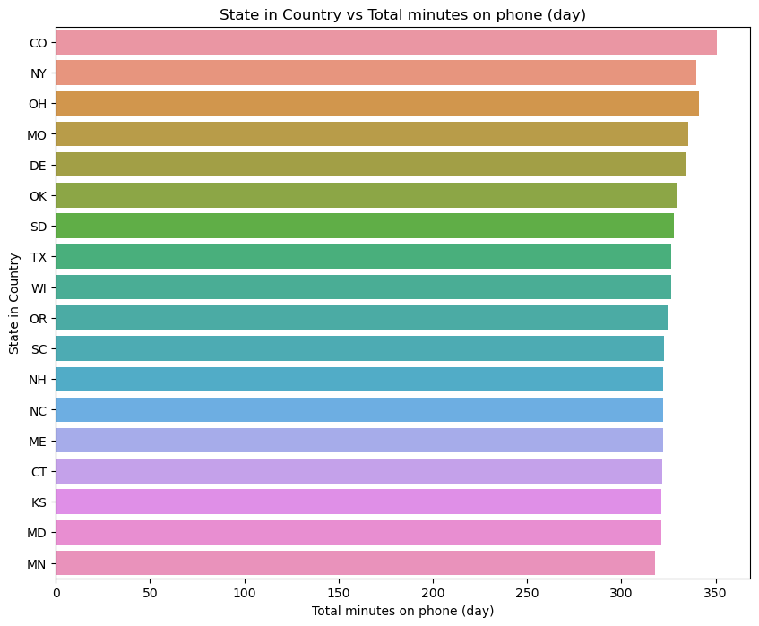
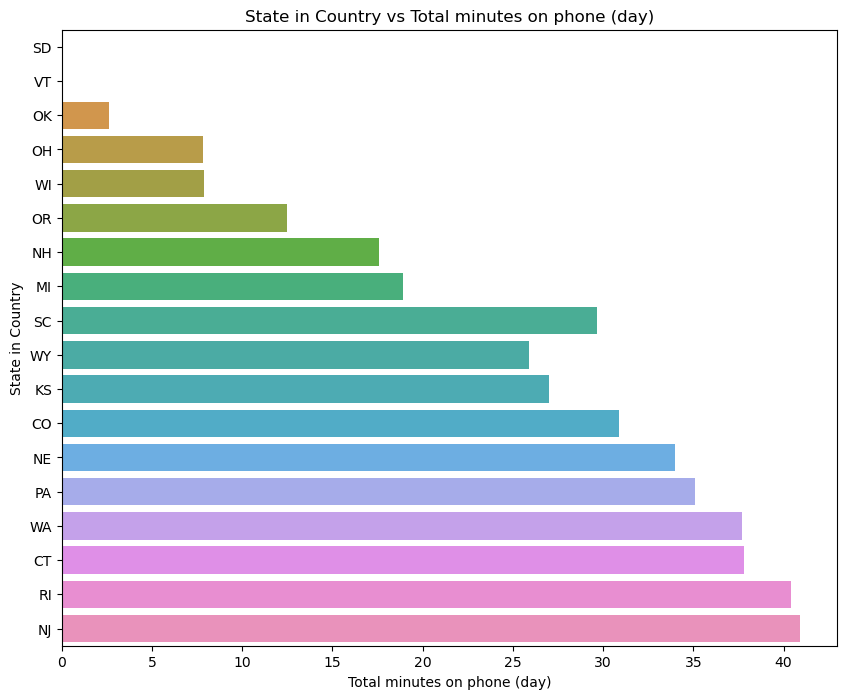
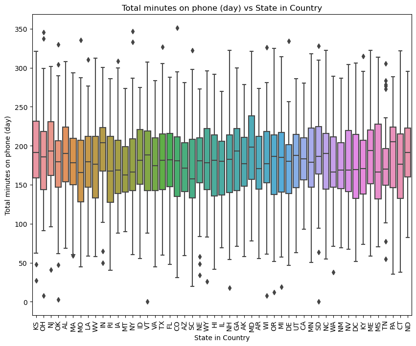

# SyriaTel Customer Churn

SyriaTel, a telecommunications company, is grappling with customer churn, a challenge faced by many businesses in the industry. The pressing issue is the financial impact of customers discontinuing their services, leading to revenue loss and potentially hindering the company's growth. To address this concern, the company seeks to leverage machine learning to build a classifier that predicts whether a customer is likely to churn in the near future. The goal is to identify patterns and factors contributing to customer attrition, enabling proactive retention strategies.

## Overview

The company is finding itself at a crossroads - they are losing a surprising amount of customers and they are not sure why. They need to know well in advance how many more customers they are likely to lose, in order to not only get their financials in order, but to brace for a worst case scenario in the event that that happens.

## Business Understanding

Syriatel is a well-known telecommunications company in Syria that was founded in 2000. It provides mobile phone and internet services, and is an important player in the country's telecom market. Syriatel competes in a dynamic market with a large subscriber base, concentrating on technology developments such as developing 4G services. The corporation operates in a regulated environment, overcoming technological, regulatory, and market competitive issues. Corporate social responsibility is almost certainly one of its objectives.

## Data Understanding

A dataset was provided by the company, which gave sample customers and a host of what they deemed as relevant information. The data was analysed in order to establish the basics of the resultant dataframe, such as the shape, number of non-null values and columns present in the dataset.

A few visualisations were also given to give a quick insight into how some of the features would relate with each other as seen below.

;

## Data Preparation

Various steps were carried out here, starting with the identification of outliers in the dataset. After much back and forth, it was deemed that the outliers were still necessary as these outliers considered extremities due to the political situation in that region.

Furthermore, there were columns that had been identified to carry similar data in them. The data may not be the exact same thing, but it was deemed fairly similar to

## Modelling

## Evaluation
